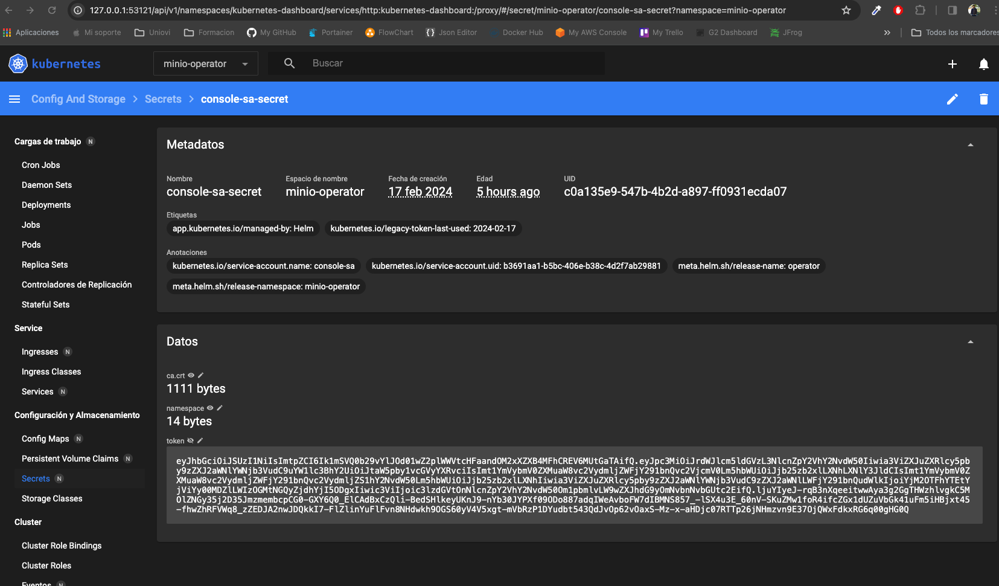
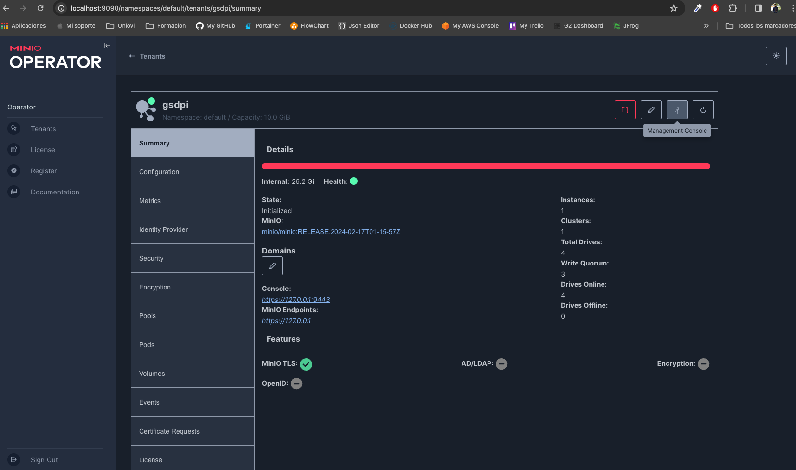
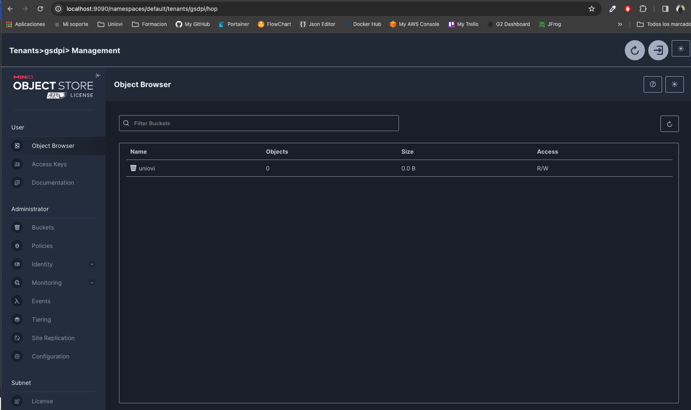

# Description
PoC Minio Object Storage using Minio Operator from minikube

## Start minikube

Start minikube cluster
```sh
$ minikube start
```

Activate Dashboard

```sh
$ minikube dashboard
```

## Install minio from help

Install helm official repository for operator

```sh
$ helm repo add minio-operator https://operator.min.io
```

Install helm minio operator release in minikube, wait and recover all kubernetes resources created

```sh
$ helm install \
  --namespace minio-operator \
  --create-namespace \
  operator minio-operator/operator

$ kubectl get all -n minio-operator
```

We can get the Minio Management console Token from secret




## Access to minio console

Create a port forward to connect to minio web console manager, to create tenants

```sh
$ kubectl port-forward svc/console -n minio-operator 9090:9090
```

Connect to minio console web manager and create a tenant. Use the 

```sh
http://localhost:9090
```

## Create the tenant 
Create a namespace for the tenant

```sh
kubectl create namespace gsdpi
```

## Create the tenant 

Tenant minimal configuration from Console Web Manager:

- **Number of Servers**: 1
- **Drives per Server (Volumes)**: 4
- **Total Size**: 10Gb


Tenant State:


Tenant State Resume:


Tenant Metrics:


```sh
$ kubectl port-forward svc/gsdpi-hl 9000:9000
```

## Install minio console 

Install the minio CLI to manage your tenant from shell

```sh
$ brew install minio/stable/mc
```

Using the **access_token** and **secret_key** from tenant create the alias in unsecure mode, becaue the TLS created by minio is autosigned

```sh
mc alias set minikube https://localhost:9000 BsvW9jlpYX8TvD9F HrGdJapKsXbKEcXABWNQ2CO15v3y9MMk --insecure
Added `minikube` successfully.
```

```sh
mc admin info minikube --insecure
●  localhost:9000
   Uptime: 4 minutes 
   Version: 2024-02-17T01:15:57Z
   Network: 1/1 OK 
   Drives: 4/4 OK 
   Pool: 1

Pools:
   1st, Erasure sets: 1, Drives per erasure set: 4

4 drives online, 0 drives offline
```

## Open Tenant Management Console

Open Tenant Management console to manage buckets. Click in the Minio Management console button showed in the capture bellow



List Tenant Buckets

