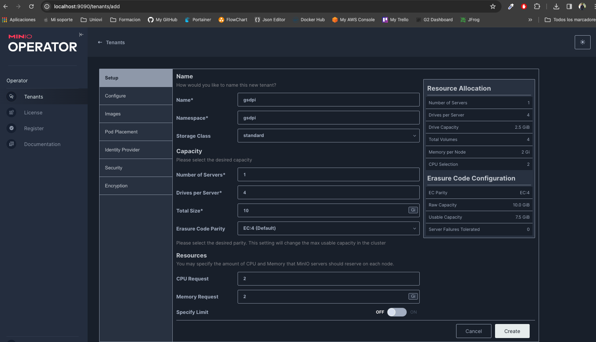
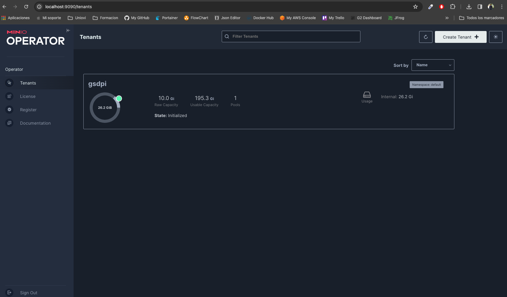
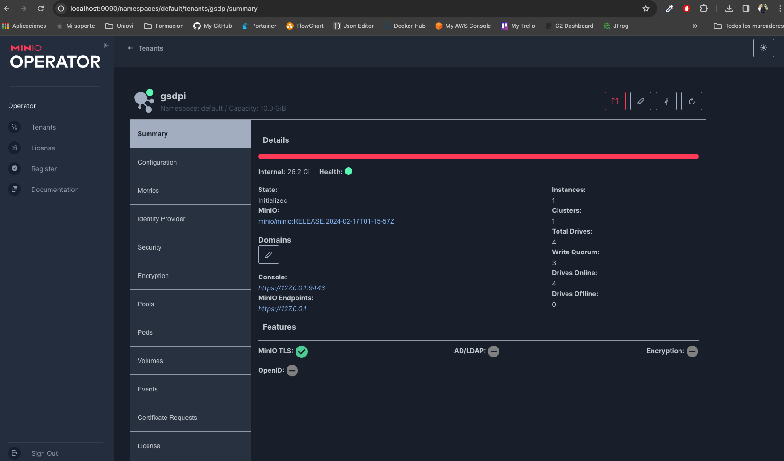
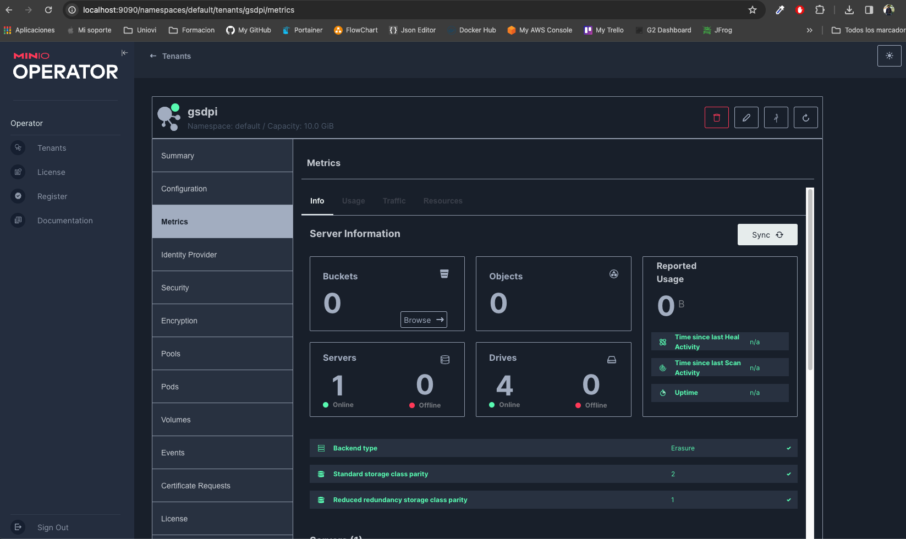

# Description
PoC Minio Object Storage in minikube

# Install minio from help

Install helm official repository

```sh
$ helm repo add minio-operator https://operator.min.io
```

Install helm release in minikube, wait and recover all kubernetes resources created

```sh
$ helm install \
  --namespace minio-operator \
  --create-namespace \
  operator minio-operator/operator

$ kubectl get all -n minio-operator
```

# Access to minio console

Create a port forward to connect to minio web console manager

```sh
$ kubectl port-forward svc/console -n minio-operator 9090:9090
```

Connect to minio console web manager and create a tenant

```sh
http://localhost:9090
```

# Create the tenant 

Tenant minimal configuration


Tenant State


Tenant Metrics


Tenant Metrics


```sh
$ kubectl port-forward svc/gsdpi-hl 9000:9000
```

# Install minio console 

Install the minio CLI to manage your tenant from shell

```sh
$ brew install minio/stable/mc
```

Using the **access_token** and **secret_key** from tenant create the alias in unsecure mode, becaue the TLS created by minio is autosigned

```sh
mc alias set minikube https://localhost:9000 BsvW9jlpYX8TvD9F HrGdJapKsXbKEcXABWNQ2CO15v3y9MMk --insecure
Added `minikube` successfully.
```

```sh
mc admin info minikube --insecure
●  localhost:9000
   Uptime: 4 minutes 
   Version: 2024-02-17T01:15:57Z
   Network: 1/1 OK 
   Drives: 4/4 OK 
   Pool: 1

Pools:
   1st, Erasure sets: 1, Drives per erasure set: 4

4 drives online, 0 drives offline
```